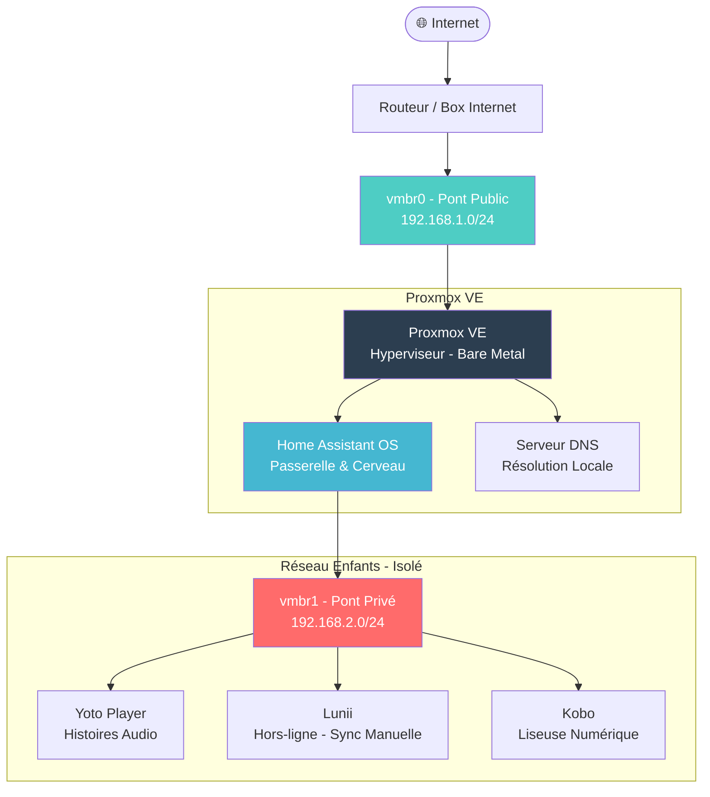

# Architecture Réseau

[English Version 🇺🇸](architecture.md)

---

## Schéma d'Infrastructure



---

## Segments Réseau

| Segment | Pont | Sous-réseau | Rôle |
|---|---|---|---|
| **GESTION** | vmbr0 | 192.168.1.0/24 | Admin, Home Assistant, Proxmox |
| **KIDS** | vmbr1 | 192.168.2.0/24 | Appareils IoT, isolés |

---

## Flux de Communication

```
[Appareils Enfants] --> [Home Assistant] --> [Internet]
                               ↑
                        Seul point de passage
                        entre les deux réseaux
```

- Les appareils enfants **ne peuvent pas** atteindre le réseau de gestion directement
- Home Assistant est **l'unique passerelle** entre les deux réseaux
- L'accès Internet depuis le réseau KIDS est **limité au HTTPS pour les mises à jour uniquement**

---

## Principes de Conception

- **Isolation réseau** : Les appareils IoT sur un pont privé dédié
- **Passerelle unique** : Home Assistant contrôle tout le trafic inter-réseaux
- **Blocage par défaut** : Tout ce qui n'est pas explicitement autorisé est bloqué
- **Souveraineté locale** : Contenu servi localement, sans dépendance au cloud
