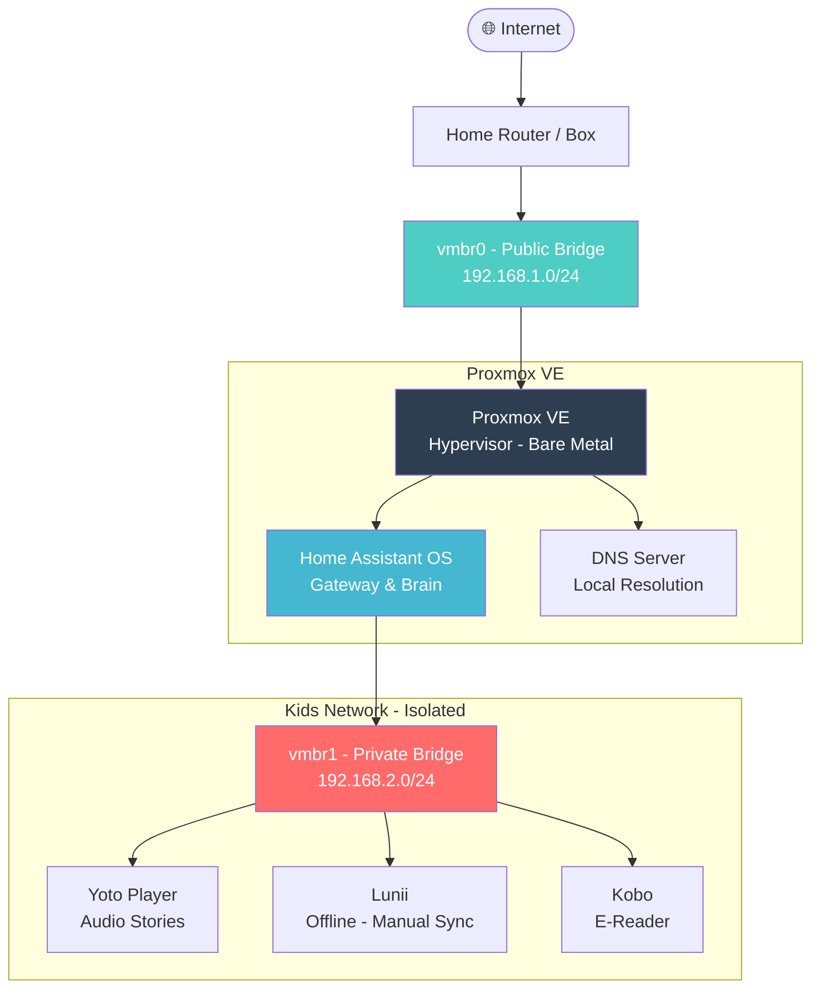

# Network Architecture

[Version Française 🇫🇷](architechture.fr.md)

---

## Infrastructure Diagram



---

## Network Segments

| Segment | Bridge | Subnet | Role |
|---|---|---|---|
| **MANAGEMENT** | vmbr0 | 192.168.1.0/24 | Admin, Home Assistant, Proxmox |
| **KIDS** | vmbr1 | 192.168.2.0/24 | IoT devices, isolated |

---

## Traffic Flow

```
[Kids Devices] --> [Home Assistant] --> [Internet]
                        ↑
                  Only gateway
                  between networks
```

- Kids devices **cannot** reach the management network directly
- Home Assistant is the **only** bridge between both networks
- Internet access from Kids network is **limited to HTTPS updates only**

---

## Key Design Principles

- **Network isolation** : IoT devices on a dedicated private bridge
- **Single gateway** : Home Assistant controls all inter-network traffic
- **Deny by default** : Everything not explicitly allowed is blocked
- **Local sovereignty** : Content served locally, no cloud dependency
